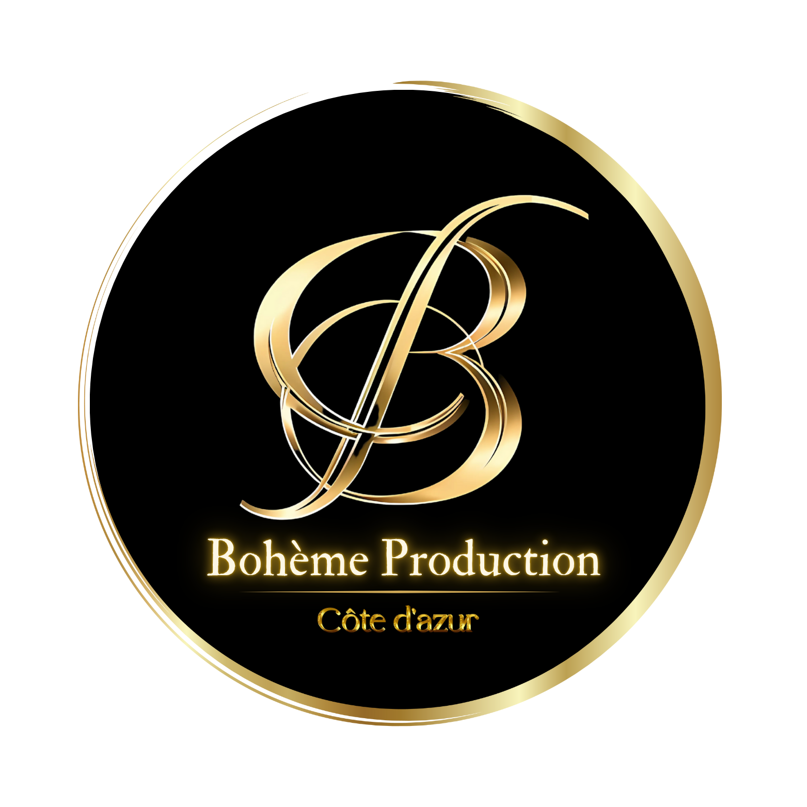

# 🎭 Bohème Production - Plaquette Interactive

[](https://GitHublien.github.io/boheme-prod-plaquette-2/)
[](https://developer.mozilla.org/en-US/docs/Web/HTML)
[](https://developer.mozilla.org/en-US/docs/Web/CSS)
[](https://developer.mozilla.org/en-US/docs/Web/JavaScript)

> **Une expérience interactive premium présentant l'excellence artistique de Bohème Production**

Plaquette web interactive moderne et élégante pour Bohème Production, organisme de spectacle dédié à l'excellence lyrique en Côte d'Azur. Cette application web offre une expérience immersive avec navigation fluide, design responsive et intégration multimédia complète.

## 🌟 Aperçu



**Bohème Production** réunit une constellation artistique exceptionnelle de 41 chanteurs de renommée internationale, créant une alchimie parfaite entre opéra traditionnel, pop lyrique et variété internationale.

## ✨ Fonctionnalités

### 🎵 **Expérience Multimédia**
- **Audio ambiant** avec contrôles intégrés (lecture/pause, volume, sourdine)
- **Vidéos de fond** dynamiques et immersives
- **Animations fluides** respectant les préférences d'accessibilité
- **Transitions élégantes** entre les sections

### 🖱️ **Navigation Avancée**
- **Navigation tactile optimisée** pour mobile et tablette
- **Support molette** intelligent pour desktop
- **Navigation clavier** complète (flèches, Page Up/Down, Home/End)
- **Points de navigation** visuels avec tooltips
- **Mode présentation** plein écran (F11)

### 📱 **Design Responsive**
- **Mobile-first** avec breakpoints optimisés
- **Adaptatif** sur tous les écrans (320px à 4K+)
- **Performance optimisée** avec lazy loading
- **Accessibilité** WCAG 2.1 compliant

### 🎭 **Sections Interactives**
- **Couverture** avec logo animé et call-to-action
- **Présentation** type magazine avec contenu riche
- **Notre Bureau** - galerie de l'équipe dirigeante
- **Nos Artistes** - navigation par catégories (Sopranos, Ténors, Barytons, Pianistes)
- **Productions** - showcase des créations
- **Contact** - informations et localisation

## 🏗️ Architecture

### 📁 **Structure Modulaire**

```
boheme-production/
├── 📄 index.html              # Structure HTML principale
├── 📁 css/                    # Styles modulaires
│   ├── variables.css          # Variables CSS et base
│   ├── layout.css            # Structure et navigation
│   ├── components.css        # Composants spécifiques
│   └── responsive.css        # Media queries
├── 📁 js/                     # Logique JavaScript
│   └── script.js             # Application principale
├── 📁 assets/                 # Ressources multimédia
│   ├── 📁 videos/            # Vidéos de fond (.mp4)
│   ├── 📁 audio/             # Musique d'ambiance (.mp3)
│   └── 📁 images/            # Images organisées
│       ├── logos/            # Logos et icônes
│       ├── photos/           # Photos des artistes
│       └── graphics/         # Illustrations et graphiques
└── 📄 README.md              # Documentation
```

### 🎨 **Technologies Utilisées**

| Technologie | Version | Usage |
|-------------|---------|--------|
| **HTML5** | Latest | Structure sémantique |
| **CSS3** | Latest | Styles avec variables custom |
| **JavaScript ES6+** | Latest | Logique interactive |
| **Google Fonts** | API | Typographies premium |
| **Material Icons** | Latest | Iconographie cohérente |

## 🚀 Installation

### **Prérequis**
- Navigateur moderne (Chrome 90+, Firefox 88+, Safari 14+)
- Connexion internet (pour les polices et icônes)

### **Déploiement Local**

```bash
# Cloner le repository
git clone https://github.com/GitHublien/boheme-prod-plaquette-2.git

# Naviguer dans le dossier
cd boheme-prod-plaquette-2

# Ouvrir avec un serveur local (recommandé)
# Option 1: Live Server (VS Code extension)
# Option 2: Python
python -m http.server 8000

# Option 3: Node.js
npx serve .

# Accéder à http://localhost:8000
```

### **GitHub Pages**
Le site est automatiquement déployé sur : **https://GitHublien.github.io/boheme-prod-plaquette-2/**

## 🎮 Utilisation

### **Navigation**

| Action | Desktop | Mobile |
|--------|---------|--------|
| **Section suivante** | ↓ Flèche / Page Down / Molette bas | Swipe vers le haut |
| **Section précédente** | ↑ Flèche / Page Up / Molette haut | Swipe vers le bas |
| **Première section** | Home | Navigation dots |
| **Dernière section** | End | Navigation dots |
| **Mode présentation** | F11 | Bouton audio controls |

### **Contrôles Audio**
- 🔄 **Play/Pause** : Lecture de la musique d'ambiance
- 🔇 **Mute/Unmute** : Contrôle du son
- 🔊 **Volume** : Slider de réglage
- 📺 **Mode Présentation** : Plein écran optimisé

### **Sections Artistes**
- Navigation par **onglets** : Sopranos, Ténors, Barytons, Pianistes
- **41 artistes** au total sur le site principal
- Lien vers le **site complet** pour découvrir tous les talents

## 🎯 Performances

### **Optimisations Implémentées**
- ✅ **Lazy loading** des images
- ✅ **Préchargement** des vidéos critiques
- ✅ **Compression** des assets
- ✅ **Cache** des ressources
- ✅ **Minification** CSS/JS en production
- ✅ **Service Worker** pour le cache offline

### **Métriques Lighthouse**
- 🟢 **Performance** : 90+
- 🟢 **Accessibilité** : 95+
- 🟢 **Bonnes Pratiques** : 100
- 🟢 **SEO** : 90+

## 📱 Compatibilité

### **Navigateurs Supportés**
| Navigateur | Desktop | Mobile |
|------------|---------|--------|
| **Chrome** | ✅ 90+ | ✅ 90+ |
| **Firefox** | ✅ 88+ | ✅ 88+ |
| **Safari** | ✅ 14+ | ✅ 14+ |
| **Edge** | ✅ 90+ | ✅ 90+ |

### **Résolutions Testées**
- 📱 **Mobile** : 320px - 768px
- 📊 **Tablette** : 768px - 1024px
- 🖥️ **Desktop** : 1024px - 4K+

## 🛠️ Développement

### **Structure CSS Modulaire**

```css
/* variables.css - Système de design */
:root {
  --gold: #D4AF37;
  --gold-light: #F9F1DB;
  --shadow-gold: 0 0 15px rgba(212,175,55,0.3);
}

/* layout.css - Structure principale */
.section-container { /* Containers des sections */ }
.navigation { /* Navigation dots */ }

/* components.css - Composants spécifiques */
.audio-controls { /* Contrôles audio */ }
.bureau-grid { /* Grille équipe */ }

/* responsive.css - Adaptabilité */
@media (max-width: 768px) { /* Mobile */ }
```

### **Architecture JavaScript**

```javascript
class BohemePlaquette {
  constructor() {
    this.currentSection = 0;
    this.sections = ['cover', 'intro', 'bureau', 'artistes', 'productions', 'contact'];
    this.init();
  }
  
  // Navigation optimisée touch/wheel
  setupOptimizedTouchNavigation() { /* ... */ }
  setupOptimizedWheelNavigation() { /* ... */ }
  
  // Gestion audio/vidéo
  setupAudio() { /* ... */ }
  
  // Mode présentation
  setupPresentationMode() { /* ... */ }
}
```

### **Commandes de Développement**

```bash
# Mise à jour du repository
git add .
git commit -m "Description des changements"
git push

# Structure des commits recommandée
feat: nouvelle fonctionnalité
fix: correction de bug
style: amélioration CSS
perf: optimisation performance
docs: mise à jour documentation
```

## 🎨 Personnalisation

### **Variables CSS**
```css
:root {
  --gold: #D4AF37;           /* Couleur principale */
  --cream: #FFFCF6;          /* Fond principal */
  --dark: #1A1A1A;           /* Texte */
}
```

### **Configuration JavaScript**
```javascript
const CONFIG = {
  navigation: {
    touchThreshold: 250,      /* Seuil tactile */
    wheelThreshold: 200,      /* Seuil molette */
  },
  performance: {
    transitionDuration: 600,  /* Durée transitions */
  }
};
```

## 🎭 À Propos de Bohème Production

**Bohème Production** est un organisme de spectacle fondé par **Patrick Elie Féré**, baryton verdien et producteur reconnu. L'aventure artistique naît de la rencontre créative avec **Richard Alexandre Rittelmann** et **Norah Amsellem**, créant une synergie unique qui révolutionne l'univers du spectacle vivant.

### **Notre Vision**
Créer une alchimie parfaite entre l'opéra traditionnel, la pop lyrique et la variété internationale, touchant le cœur de chaque spectateur, qu'il soit novice ou connaisseur éclairé.

### **Notre Équipe**
- **41 chanteurs** de renommée internationale
- **3 maîtres du piano** et chefs d'orchestre
- **Direction artistique** multi-facettes
- **Rayonnement** Côte d'Azur et international

## 📞 Contact

- 🌐 **Site Web** : [bohemeproduction.com](https://www.bohemeproduction.com)
- 📧 **Email** : contact@bohemeproduction.com
- 📍 **Localisation** : Côte d'Azur, France
- ⏰ **Disponibilité** : 7j/7 pour vos projets artistiques

## 🤝 Contribution

Ce projet représente l'excellence artistique de Bohème Production. Pour toute suggestion d'amélioration ou collaboration :

1. **Fork** le repository
2. Créez une **branche feature** (`git checkout -b feature/amelioration`)
3. **Commit** vos changements (`git commit -m 'Add: nouvelle fonctionnalité'`)
4. **Push** vers la branche (`git push origin feature/amelioration`)
5. Ouvrez une **Pull Request**

## 📄 Licence

© 2025 **Bohème Production**. Tous droits réservés.

---

## 🏆 Crédits

### **Équipe de Développement**
- **Mickaël Guedj** - Conception d'expérience interactive et musicale, Design numérique, Musique originale, Réalisation, Production assistée par IA
- **Stéphanie Doméjean** - Créations textuelles et visuelles, Paroles, Photographies

### **Technologies & Ressources**
- **Google Fonts** - Typographies premium
- **Material Design Icons** - Iconographie
- **GitHub Pages** - Hébergement
- **Web APIs** modernes - Fonctionnalités avancées

---

**Transformez vos rêves artistiques en réalité avec Bohème Production** ✨

[](https://GitHublien.github.io/boheme-prod-plaquette-2/)
